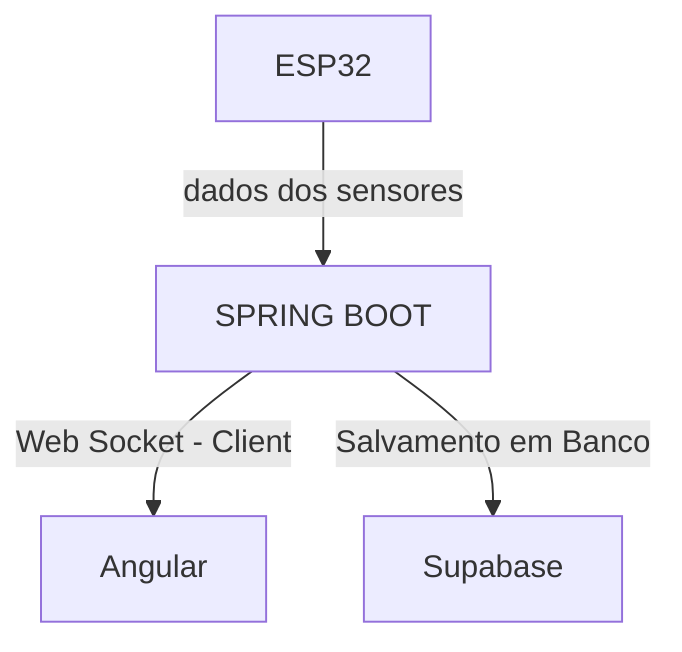
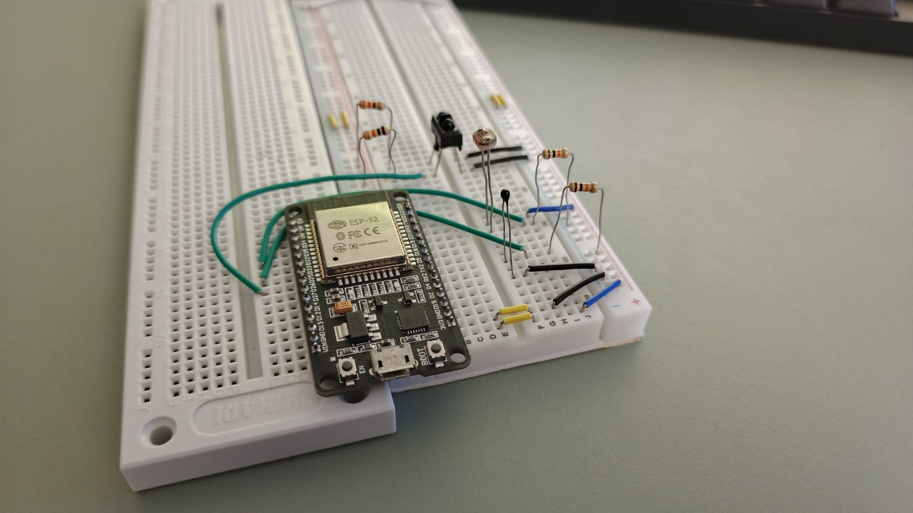

<link rel="stylesheet" type='text/css' href="https://jsdelivr.net" />

# Por dentro do projeto!

    O README.md desse projeto demonstra como foi realizado todo o processo de construção, desafios e funcionalidades da aplicação. Esse projeto foi desenvolvido por mim Julio Cesar. Espero que goste!

<i class="devicon-angular-plain" style="font-size: 70px"></i>
<i class="devicon-spring-original" style="font-size: 70px"></i>
<i class="devicon-supabase-plain" style="font-size: 70px"></i>

<h2>Diagrama</h2>

    O fluxograma do projeto pode ser visualizado no diagrama abaixo:

<h3>Etapas do Fluxograma:</h3>

    1. ESP32 conectado à internet envia requisições do tipo HTTP POST contendo JSONS com dados dos sensores (temperatura, luminosidade e presença) conectados a ele.

    2. O serviço modelado em Spring Boot recebe esses dados, realiza tratamentos caso necessário e realiza a persistência em banco de dados simultaneamente com o envio das informações via WebSocket para o cliente principal da aplicação, o Angular.

    3. O Angular "recebe" essas informações em tempo real e complementa a análise na formulação de gráficos de linha para visualização histórica.

<h2>Prototipagem</h2>

    A prototipagem do projeto contou com resistores de 10k conectados aos sensores para possibilitar as leituras através dos divisores de tensão. Além disso, o circuito contém distinção clara dos fios de voltagem (azuis), terra (pretos), e das leituras (verdes). Os fios brancos e amarelos são usados como extensores.
